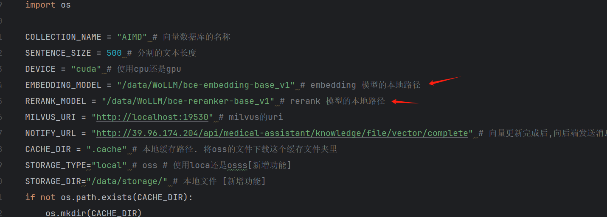
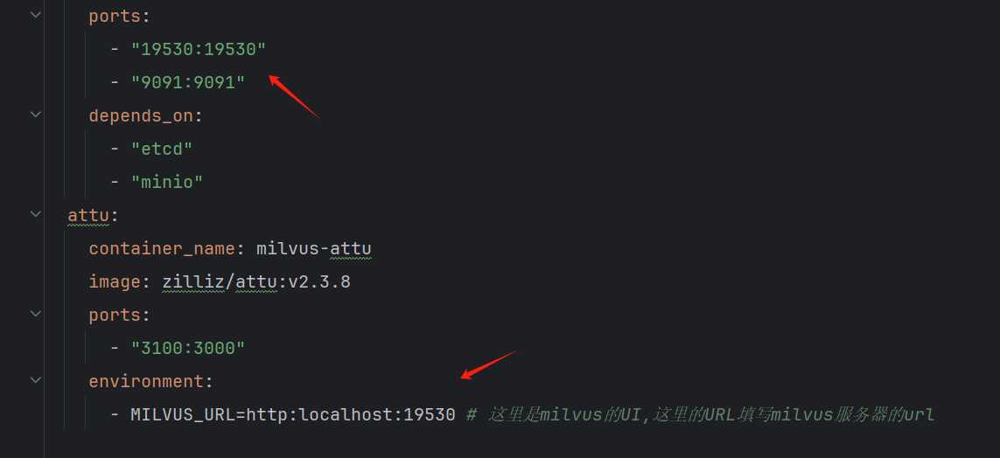

# FinRAG: Financial Retrieval Augmented Generation

[](https://discord.gg/trsr8SXpW5)


## 1. 准备工作

### 1.1 安装minicoda
#### 网址
`https://docs.anaconda.com/free/miniconda/miniconda-other-installer-links/#linux-installers`
#### python3.10.14
`wget https://repo.anaconda.com/miniconda/Miniconda3-py310_24.4.0-0-Linux-x86_64.sh`
#### 配置环境变量
`export PATH=$HOME/miniconda3/bin:$PATH`

### 1.2 启动Milvus向量数据库
- 使用docker-compose启动Milvus服务
```
cd docker     #切换至docker配置目录环境
docker-compose up -d           #启动项目中的服务，并在后台以守护进程方式运行
```
如果对docker不了解，可以看下以下文章: \
[docker-compose快速入门](https://blog.csdn.net/m0_37899908/article/details/131268835) \
[docker-conpose命令解读](https://blog.csdn.net/weixin_42494218/article/details/135986248) \
术语说明: \
  守护进程: 是一类在后台运行的特殊进程，用于执行特定的系统任务,会一直存在。如果以非守护进程启动，服务容易被终止。

- Milvus 前端展示地址
`http://{ip}:3100/#/` 把ip替换为你所在服务器的ip地址即可

### 1.3 Embedding以及Rerank模型下载
- 新建/data/WoLLM 目录
- 将以下两个模型下载到新建的目录中
- Embedding Model 下载：`git clone https://www.modelscope.cn/maidalun/bce-embedding-base_v1.git`
- Rerank Model 下载：`git clone https://www.modelscope.cn/maidalun/bce-reranker-base_v1.git`
说明: \
  Embedding Model: 主要是完成将自然语言文本转化为固定维度向量的工作，主要在知识库的建模，用户查询query表示时会应用。 \
  Rerank Model：对结果进行重排操作。 \
  这里采用的都是bce的模型，因为其在RAG上表现较好，可以参考资料，了解一下背景: \
  [BCE Embedding技术报告](https://zhuanlan.zhihu.com/p/681370855) \
  下载好两个模型后, 将模型放到指定的位置，并更新项目conf.config.py文件中EMBEDDING_MODEL和RERANK_MODEL对应参数的路径(和模型路径保持一致)。如图:



### 1.4 安装依赖及修改配置信息
#### 新建python虚拟环境
`python -m venv .venv`
#### 激活环境
`source .venv/bin/activate`
#### 安装项目依赖
`pip install -r requirements.txt`

### 1.5 修改配置文件

- 配置文件在conf/config.py
- 配置文件的各项信息修改为自己的信息, 每个变量已经加了详细注释.
- 可能需要改动的参数一般就是两个模型文件目录，如图:

- 如果你需要修改端口，或者服务器变更，你需要修改docker.docker-compose.yml中的配置参数，一般就是修改ip和端口。


### 1.6 修改环境变量

- 将.env_user复制为.env `cp .env_user .env` [重要,重要,重要. 必须复制一下]
- 修改.env的LLM以及OSS相关变量信息(目前只需要复制一下即可, 不需要修改里面的内容了)

## 2. 启动App
### 2.1 第一种方式启动
`python main.py`
### 2.2 第二种方式启动(为之后打进docker做准备,目前先用第一种方式)
`bin/start.sh`


ToDo
- [ ] rag 优化
  - [ ] 多级索引优化
  - [ ] 多查询优化
  - [ ] query优化
  - [ ] 解析优化
